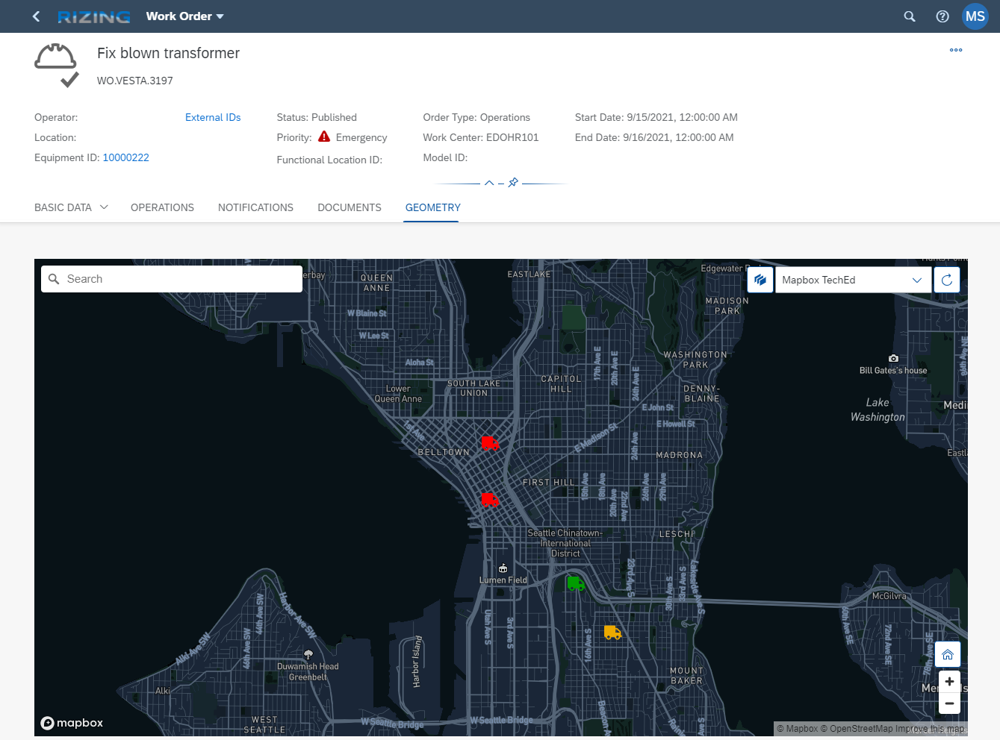
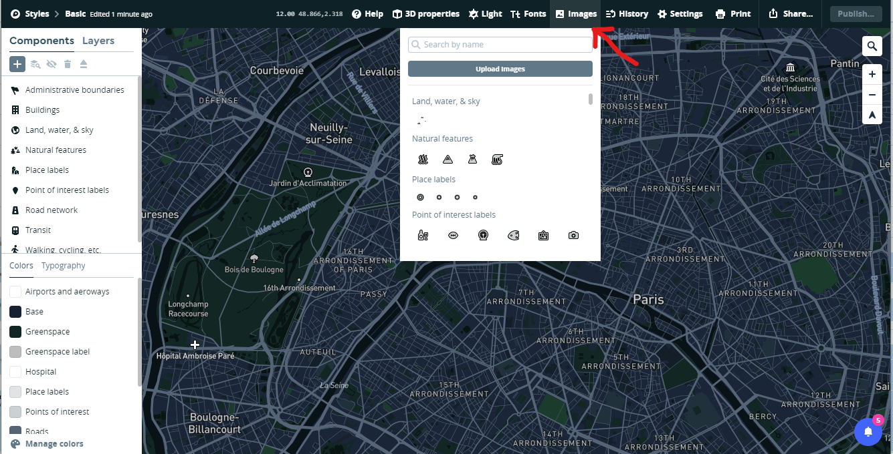
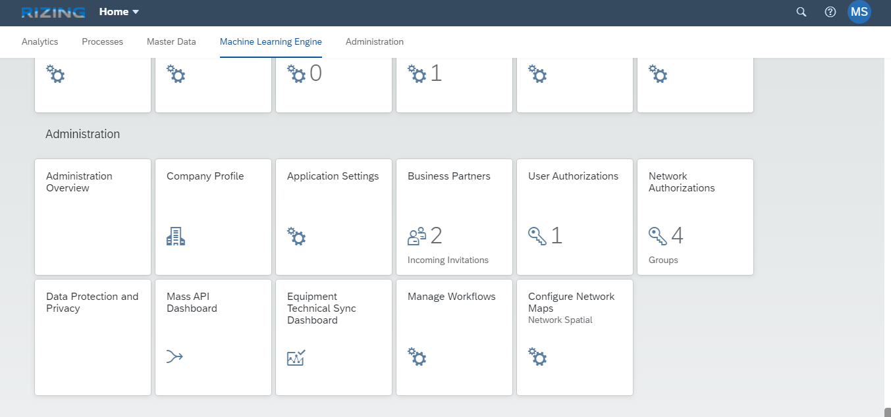

# SAP TechEd 2021 - Network Spatial CAP Service Example  
The intent of this example is to show the use of a custom, CAP based, spatial data provider in the SAP Network Spatial Service (NSS) component.



You will use the NSS configuration app to configure the additional service. 

## Prerequisites
1. Business Network - Specifically Asset Intelligence Network (AIN) (or Test and Demo license thereof)
2. BPT Licenses (or Trial to start with)
    - Application Runtime
    - HANA Cloud
3. Mapbox API Key

## Configuration
In order to build a scenario that does not conflict with anything else we will create a complete new renderer and additional layer. 

1. Either follow the instructions in the section **"Step by Step instructions to develop a CAP based source service"** to create and deploy the service (`mbt build` and `cf deploy`). 
2. Configure a custom Mapbox style. You will need to do this if you want to implement this scenario as described in here and/or you want to use colorful symbols. You can skip this step if you simply want to chose circles (in which case you have to adjust the layer definition outlined below
    1. Open up Mapbox Studio [https://studio.mapbox.com/](https://studio.mapbox.com/)
    2. Select 'New Style'
    3. Choose a template - I used 'Basic' with 'Galaxy' variation
    4. Hit the 'Customize Basic' button at the bottom
    5. Find the Images button at the top and drag and drop the three images located in the [./doc/mapbox-config](./doc/mapbox-config) folder into the 'Images' section
        <br><br>
    6. Hit the publish button to save and publish your changes
    7. Back in the styles menu, click on the three vertical dots and copy the "Style URL" for use below
3. Configure the new Scenario
    1. Open up the NSS configuration app (Configure Network Maps - Last App in the list below)

        

    2. Start by Creating a new Renderer
        - **API Key:** [Paste your Mapbox API Key here, usually start with "pk..."] 
        - **URL:** https://bnc-nss-map-sbx.cfapps.sap.hana.ondemand.com/nsc/map/
        - **Default Style:** [Copy the Mapbox style from the previous step and paste it here]
    3. Create a new Layer
        - **Type:** Symbol
        - **Source Type:** GeoJSON
        - **Service URL:** [route to app router module]/geojson
        - **Layout JSON:** 
        ```json
        {
          "icon-image": ["match",
                        ["get", "status"],
                        1,"truck-green-50",
                        2,"truck-orange-50",
                        "truck-red-50"], 
          "icon-size": 0.5
        }
        ```
    4. Create a new Scenario
        - **Enable Draw Toolbar:** 'No' - as this is a read only scenario
        - **Enable Bounding Box:** 'Yes' - you want to zoom automatically to your selected feature
        - **Bounding Box Padding:** 200
        - Add the three layers (Current Objects Polygons, Point and Lines to the Layers list, assign a common Group Name (i.e. 'Current') to all three layers.
        - Now add our new Layer to the layers list and set Locked = 'Yes'
    5. Select the Work Order App application, click edit and add the new scenario to the Scenarios list.
4. Once you have performed these steps you should be good to go. Open the 'Work Orders' App, navigate to the 'GEOMETRY' Tab and switch the scenario to yours. It should looks like this: 

    
<br><br>

## Step by Step instructions to develop a CAP based source service 
1. Create CAP project using `cds init` command
2. Add HANA and mta.yaml using `cds add hana` command
3. Adjusted the 'mta.yaml' file to make some changes I like
    - Adjusted the mta id
    - Changed the mta description
    - Added 2 parameters to the service
    ```yaml
      - memory: 200M
      - disk-quota: 250M
    ```
    - Added a explict schema name to the database service
    ```yaml
        config:
          schema: teched_2021
    ```
4. Add the [data model](./db/core.cds)
5. Add the [service](./srv/example.cds)
6. Add the [Rest Test Script](./test/example-service.http)
    - At this point you developed the basic service that works locally and can be deployed, but is not functioning in the cloud yet.
7. Added some [custom handlers](./srv/handlers/example.js) and some [supporting functions](./srv/handlers/supportfunctions.js) to allow for the storage and read of spatial data in a HANA environment.
8. To expose the service as REST GeoJSON service we create a file with the name [server.js](./srv/server.js) in the srv directory (must be in this directory). The content in this file allows for the addition of an express server endpoint during the bootstrap process. This functionality also converts the OData response to GeoJSON.
    - You can now access the service via the following URL: [host]/geojson
9. To remove CORS restriction you can add an app router
  - see files in directory /approuter
  - make the following changes in the mta.yaml file
  ```yaml
   # ------------------- APP ROUTER MODULE -----------------------
 - name: teched-2021-router # Approuter Module channeling the traffic to the correct destination
 # ------------------------------------------------------------
   type: nodejs
   path: approuter
   parameters:
      memory: 100M
      buildpack: nodejs_buildpack
   requires:
      - name: teched-2021-srv_api
        group: destinations
        properties:
          name: teched-2021-srv_api
          url: ~{srv-url}
          forwardAuthToken: true
          timeout: 600000
   properties:
      COOKIES: >
          { "SameSite": "None" }
      CORS: >
          [
            {
              "uriPattern": "^(.*)$",
              "allowedOrigin": [ 
                                { "host": "*.hana.ondemand.com", "protocol": "https" },
                                { "host": "*.hana.ondemand.com", "protocol": "http" }
              ],
              "allowedMethods": ["GET", "POST", "HEAD", "OPTIONS", "PUT", "DELETE"],
              "allowedHeaders": ["Origin", "Accept", "X-Requested-With", "Content-Type", 
                                                    "Access-Control-Request-Method", 
                                                    "Access-Control-Request-Headers", "Authorization", "X-Sap-Cid", 
                                                    "X-Csrf-Token", "Accept-Language"],
              "exposeHeaders": ["Accept", "Authorization", "X-Requested-With", "X-Sap-Cid", 
                                                  "Access-Control-Allow-Origin", "Access-Control-Allow-Credentials", 
                                                  "X-Csrf-Token", "Content-Type"]
            }
          ]
  ```
10. You can test the service by using the VS Rest Client Extension with the [test script](./test/example-service.http).
